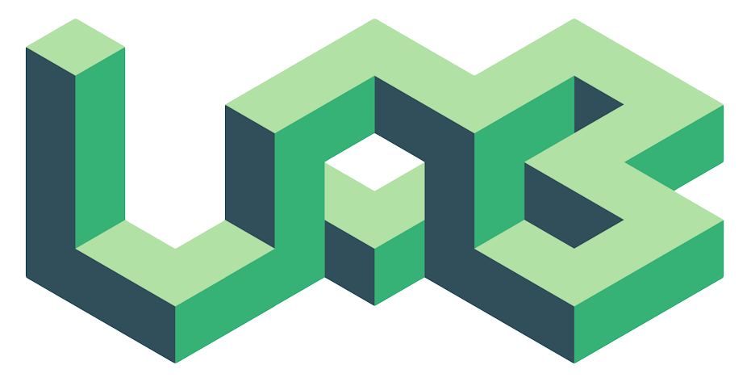
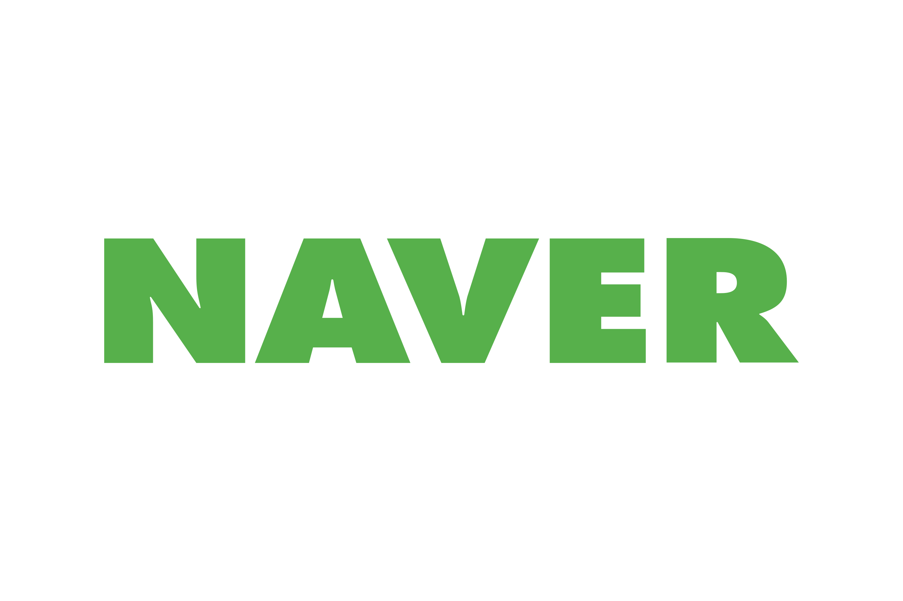

<h2 align="center">Let's Connect!</h2>

I am **Yongkyun (Daniel) Lee**, an aspiring engineering/entrepreneur working on and looking for fun ideas. I am always open to hear stories and share insights. Don't hestiate to reach out 😃

<!-- ### Experiences

<p>
    <a href="https://pagenow.io" target="_blank">
        
    </a>
    <a href="https://pagenow.io" target="_blank">PageNow</a>, 
    <i>Founder/Head Engineer</i> (Jul, 2021 - Present)
</p>

<p>
    <a href="https://www.goldmansachs.com" target="_blank">
        
    </a>
    <a href="https://www.goldmansachs.com" target="_blank">Goldman Sachs</a>, <i>Analyst</i> (Jul, 2021 - Present)
</p>

<p>
    <a href="https://lablup.com/" target="_blank">
        
    </a>
    <a href="https://lablup.com/" target="_blank">Lablup Inc.</a>, <i>Software Engineer Intern</i> (Aug, 2020 - Sep, 2020)
</p>

<p>
    <a href="https://onclusive.com" target="_blank">
        
    </a>
    <a href="https://onclusive.com" target="_blank">Onclusive</a>, <i>Software Engineer Intern</i> (Jun, 2019 - Sep, 2019)
</p>

<p>
    <a href="https://www.navercorp.com/" target="_blank">
        
    </a>
    <a href="https://www.navercorp.com/" target="_blank">Naver</a>, <i>AI Research Intern Intern</i> (Jun, 2018 - Sep, 2018)
</p> -->

### Skills

<p>


</p>
    
### Recent blog posts

* [PageNow - Part 1 (Development Overview)](https://noninertialframe.com/blog/PageNow%20-%20Part%201%20%28Development%20Overview%29)
* [Graduating from Caltech](https://noninertialframe.com/blog/Graduating%20from%20Caltech)
* [Effect of Corruption on Stock Market Development](https://noninertialframe.com/blog/Effect%20of%20Corruption%20on%20Stock%20Market%20Development)
* [Noninertial Frame Update - Version 3](https://noninertialframe.com/blog/Noninertial%20Frame%20Update%20-%20Version%203)

### Recently read books

* [Fintech Founders: Inspiring Tales from the Entrepreneurs that are Changing Finance](https://www.goodreads.com/book/show/49505988-fintech-founders)
* [Antifragile: Things That Gain from Disorder](https://www.goodreads.com/book/show/13530973-antifragile)
* [Misbehaving: The Making of Behavioral Economics](https://www.goodreads.com/book/show/26530355-misbehaving)
* [Loonshots](https://www.goodreads.com/book/show/39863447-loonshots)

### Find me on

<a href="https://wwww.noninertialframe.com" target="_blank">
    
</a>
<a href="https://www.linkedin.com/in/yongkyunlee/" target="_blank">
    
</a>
<a href="https://stackoverflow.com/users/14090412/noninertialframe" target="_blank">
    
</a>
<a href="mailto:yonkyun.daniel.lee@gmail.com">
    
</a>

### Statistics

<!--START_SECTION:waka-->
📊 **This Week I Spent My Time On** 

```text
⌚︎ Time Zone: America/New_York

💬 Programming Languages: 
Python                   6 hrs 10 mins       █████████░░░░░░░░░░░░░░░░   36.71% 
HTML                     2 hrs 46 mins       ████░░░░░░░░░░░░░░░░░░░░░   16.53% 
TypeScript               2 hrs 28 mins       ███░░░░░░░░░░░░░░░░░░░░░░   14.74% 
JavaScript               1 hr 50 mins        ██░░░░░░░░░░░░░░░░░░░░░░░   10.96% 
Markdown                 1 hr 43 mins        ██░░░░░░░░░░░░░░░░░░░░░░░   10.24%

🐱‍💻 Projects: 
chat-client              5 hrs 20 mins       ████████░░░░░░░░░░░░░░░░░   31.79% 
user-api                 5 hrs               ███████░░░░░░░░░░░░░░░░░░   29.79% 
advent_of_code           3 hrs 42 mins       █████░░░░░░░░░░░░░░░░░░░░   22.1% 
chrome-extension         1 hr 51 mins        ██░░░░░░░░░░░░░░░░░░░░░░░   11.11% 
presence-api             35 mins             █░░░░░░░░░░░░░░░░░░░░░░░░   3.55%

```


<!--END_SECTION:waka-->

